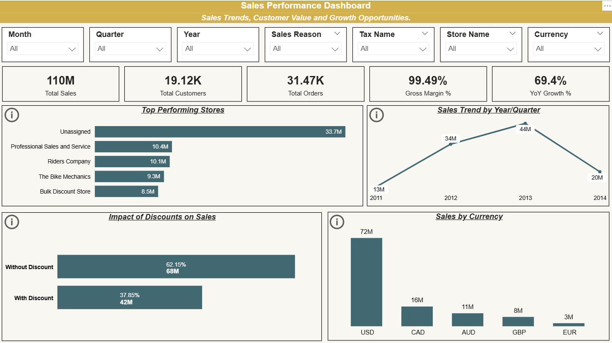
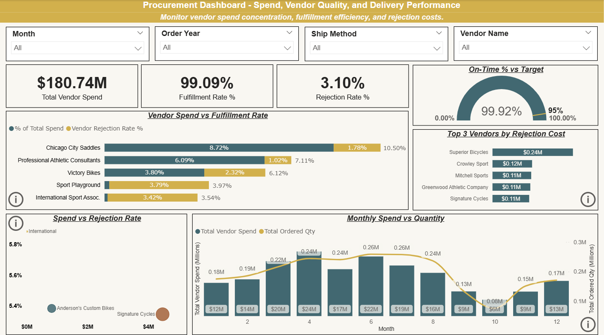
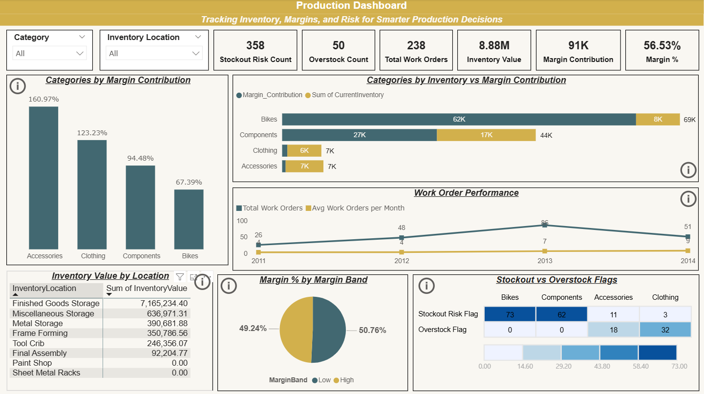
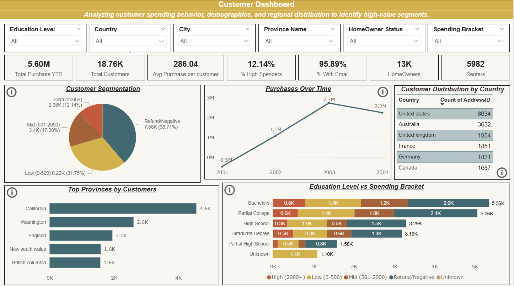
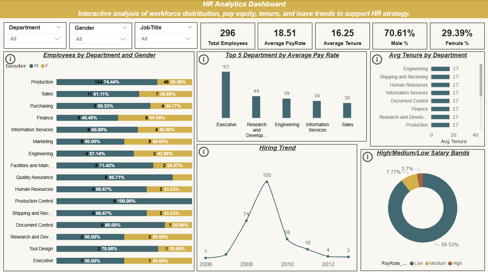

# AdventureWorks Analytics Project

An **end-to-end data analytics case study** using Microsoft's **AdventureWorks** dataset. 

This project demonstrates a **complete analytics pipeline** across SQL, Excel, and Power BI.  
It highlights skills in **data cleaning, transformation, visualization, and business storytelling**.  

**Business Goal:** Analyze AdventureWorks across **Sales, Procurement, Production, HR, and Customers** to uncover insights that drive better decision-making and performance optimization. 

---

## Database Context
The raw **AdventureWorks OLTP database** contains dozens of normalized tables (Person, Production, Sales, Purchasing, Human Resource )


- In this project: 
1. **Joined and cleaned raw tables** into analysis-ready datasets (`sql/sql_raw`)
2. **Created department-wise backup tables** (`sql/sql_transformed`) for:
    - Sales
    - Customers
    - Purchasing
    - Production
    - HR
3. Exported departmental datasets into Excel (`excel/`)for further analysis and charting. 
4. Built **5 one-page Power BI dashboards** (`power_bi/`) (one for each department).


---

## Project Workflow
1. **Data Extraction & Cleaning (SQL)** (`sql/sql_raw`)
- Wrote SQL queries to join, filter, and clean raw AdventureWorks tables. 
- Handled missing values, column renaming, and applied business logic. 

2. **Data Transformation (SQL)** (`sql/sql_transformed`)
- Created **department-wise summary/backup tables** (SalesOverview, CustomerInfo, HR, Production, Purchasing).
- Exported these tables into Excel (`adventure_works_analysis`). 

2. **Data Exploration & Analysis (Excel)** (`excel/`)
- Applied column renaming, formatting, and consistency checks.
- Built **exploratory charts** with in-detail insights.

3. **Visualization (Power BI)** (`power_bi/adventure_works.pbix`)
- Imported Excel data into Power BI. 
- Designed **five one-page dashboards** with slicers, KPI, and charts. 


---
## Repository Structure

```plaintext
adventure_works/
│── README.md                  # Project overview
│── insights.md                # Detailed business insights
│
├── sql/
│   ├── sql_raw/               # Raw extraction queries
│   │   ├── customer_info.sql
│   │   ├── hr.sql
│   │   ├── production.sql
│   │   ├── purchasing.sql
│   │   └── sales.sql
│   │
│   └── sql_transformed/       # Transformed backup tables
│       ├── xl.customer_info.sql
│       ├── xl.hr.sql
│       ├── xl.production.sql
│       ├── xl.purchasing.sql
│       └── xl.sales.sql
│
├── excel/                     # Cleaned Excel exports
│   ├── adventure_works_analysis.xlsx
│   └── combined_tables.xlsx
│
├── power_bi/
│   └── adventure_works.pbix   # Power BI dashboards
│
└── dashboard_screenshots/     # Dashboard preview images
    ├── sales_dashboard.png
    ├── procurement_dashboard.png
    ├── production_dashboard.png
    ├── customer_dashboard.png
    └── hr_dashboard.png
```

---

## Dashboard Previews 
### 1. Sales Performance Dashboard
*Sales Trends, Customer Value, and Growth Opportunities*

-  KPIs: **110M Sales**, **19.1K Customers**, **31.4K Orders**, **99.5% Gross Margin**, **69.4% YoY Growth**.  
- Top-performing stores ranked by contribution.  
- Discounts impact: 62% sales without discount vs 38% with discount.  
- Sales trend tracked YoY (2011–2014).  
- Breakdown by currency: USD dominates (72M).  




### 2. Procurement Dashboard
*Spend, Vendor Quality, and Delivery Performance*

- KPIs: **$180.74M**, **99.1% Fulfillment Rate**, **3.1% Rejection Rate**.
- Vendor Spend vs Fulfillment Rate - Concentration Risks.
- Top Vendors ranked by Rejection cost.
- Rejection Rate relative to Vendor Spend.
- Monthly spend vs quantity tracked across year.
- On-time delivery rate: **99.9%**, exceeding target (95%).





### 3. Production Dashboard
*Tracking Inventory, Margin, and Risk*

- KPIs: **358 Stockouts**, **50 Overstocks**, **238 Total Orders**, **8.88M Inventory Value**, **91K Margin Contribution**, **56.5% Margin %**.
- Inventory vs Margin Contribution across product category. 
- Work order performance over the years. 
- Stockout vs Overstock analysis by Category. 
- Margin % segmented into high vs low contribution bands. 
- Inventory value by Inventory Location. 
- Category ranked by Margin Contribution. 



### 4. Customer Dashboard
*Customer Behavior, Demographics, and Segmentation*

- KPIs: **5.6M Purchase YTD**, **18.7K Customers**, **286 Avg Purchase/Customer**, **12.1% High Spenders**, **95.9% Customers with Email**, **13K HomeOwners**, **5982 Renters**.
- Segmentation: High (12.1%), Mid (17.3%), Low (31.8%), Refund/Negative (38.7%).
- Purchases Over the years. 
- Customers by country - US leads (8.6K), followed by Australia & UK.
- Province: California, Washington, and England in top spots. 
- Education level vs spending shows correlation with income. 




### 5. HR Analytics Dashboard
*Workforce Distribution, Pay Equity, and Tenure*

- KPIs: **296 Employees**, **Avg Pay Rate: 18.5**, **Avg Tenure: 16.3 yrs**, **70.6% Male**, **29.4% Female**.
- Gender split by department shows workforce imbalance. 
- Executives have the highest average pay rate. 
- Hiring peaked in **2008 (150 hires)**, then declined. 
- 89.5% of employees are in the low salary band, very few in medium/high.



---

## Insights Summary
- **Sales** - Customers buy mostly without discounts, suggesting strong pricing power. USD dominates sales currency.
- **Procurement** -  Few vendors contribute to major spend; some show higher rejection rates - supplier dependency risk.
- **Production** - Accessories & Clothing bring highest margin, while Bikes dominate inventory value. Stockout risk is highest in Bikes/Components. 
- **Customer** - Refund /negative purchases form 38.7% of transactions - policy/quality issue. US is the largest market with strong concentration. 
- **HR** - Workforce skewed toward Production; 70% male, and salary bands concentrated in low pay range. 

---

## Key Skills Demonstrated
- **SQL** - Joins, CTEs, transformation, schema-to-domain consolidation. 
- **Excel** - Cleaning, charting, exploratory insights.
- **Power BI** - Interactive dashboards with slicers, KPIs, DAX, Tooltips.
- **Data Storytelling** - Raw DB - Business-ready insights. 

---

## How to Reproduce
1. Download AdventureWorks DB - [Microsoft Docs](https://learn.microsoft.com/en-us/sql/samples/adventureworks-install-configure?view=sql-server-ver17&tabs=ssms#download-backup-files).  
2. Run scripts in `/sql/sql_raw` to clean and join raw tables.  
3. Run scripts in `/sql/sql_transformed` to generate department-level summary tables.  
4. Export results into Excel (`/excel/adventure_works_analysis.xlsx`).  
5. Open Power BI file (`/power_bi/adventure_works.pbix`) for interactive dashboards.  


